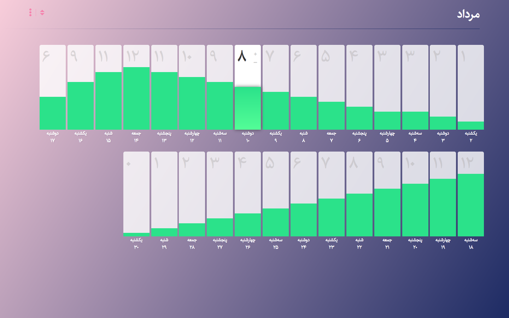

# Pomodoro Tracker 

The Pomodoro Tracker app, help me to track my own pomodoro daily habit, I wrote this app, when I was Learning React JavaScript Library, and it's a training I'm still  working on.

This app working with Jalali/Farsi date, for this reason I use [moment-jalali](https://github.com/jalaali/moment-jalaali) calendar.

### assets
* React
* moment-jalali
* sass 
* grunt
* babelify
* browserify

